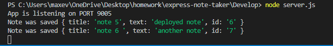

# express-note-taker
# app explantion
The front end for this project was created for me and my goal was to work primarily in the backend. The first thing that I needed to do was install express and fs. I also installed nodemon so my localhost was continously being updated. 

The apps main use is for the user to be able to create new notes. The user can make a title for those notes and then a description for the notes. When the user clicks on the note in the left column they will be shown the details inside that specific note. 

# issues
1. The first issue I ran into was trying to get the notes to parse into the db.json file. It would create the new note but wouldn't attach to the left column of the app. After looking through the code I found that I forgot to 'writeFileSync'. Once that was done I was able to attach the new notes to the left column.

2. The next issue I ran into was trying to get the app to delete the completed notes. I tried to add the script file from bootstrap hoping that would help but with no luck. I then found a youtube video that I watched in hopes that would help. After working on that bit of code the only success I was able to do was after clicking the trash can icon the note would go back to the empty note screen for the user to create a new note. 
Link to youtube video [express-youtube](https://www.youtube.com/watch?v=L72fhGm1tfE)

# deployed site / images

deployed site through heroku
[express-note-taker](https://clintrizzo.github.io/express-note-taker/)

